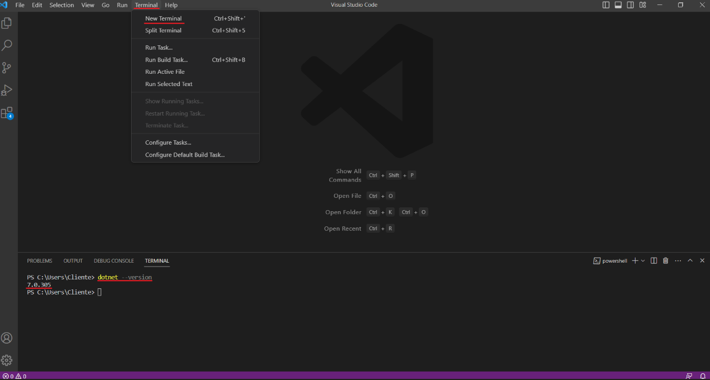
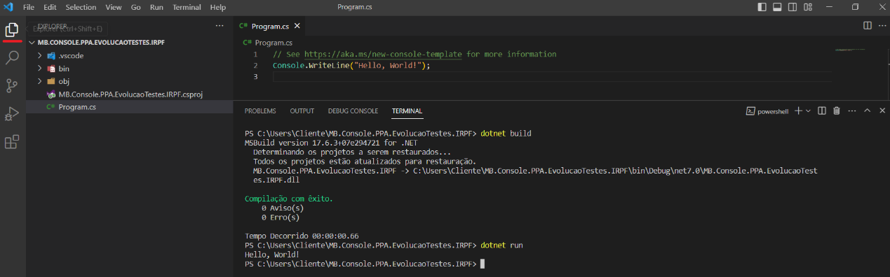
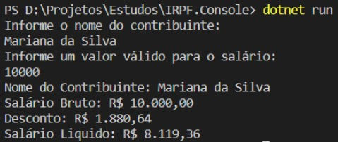
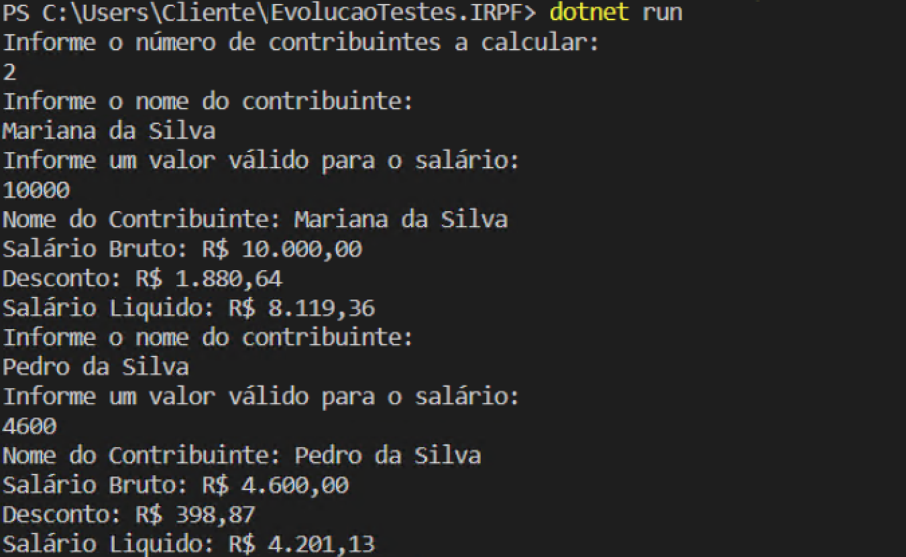
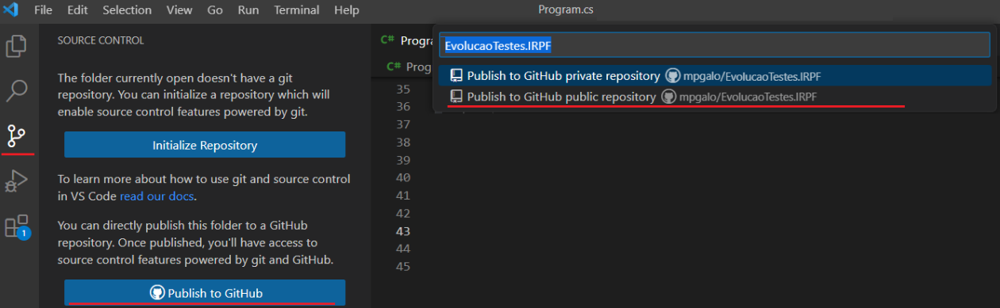
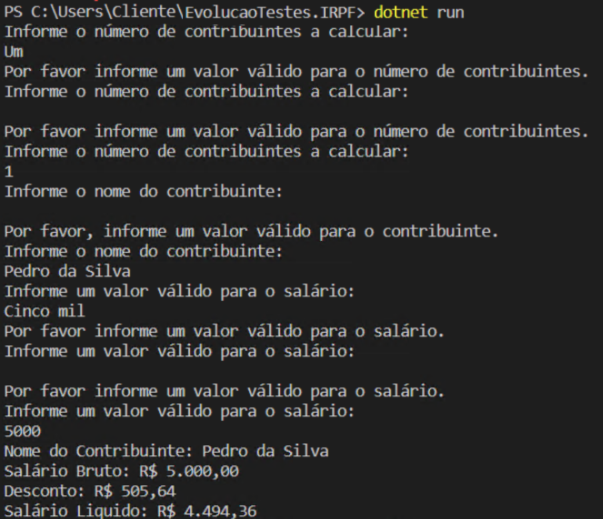

## C# Essencial 

O objetivo desta wiki é a preparação nos fundamentos de programação em C#.

### Curso Gratuito

Deve ser visto com atenção, se possível realizando os exemplos, para que após sua visualização seja possível concluir o exercício de fixação que será realizado a seguir.

::: video
<iframe width="560" height="315" src="https://www.youtube.com/embed/PKMm-cHe56g" title="YouTube video player" frameborder="0" allow="accelerometer; autoplay; clipboard-write; encrypted-media; gyroscope; picture-in-picture; web-share" allowfullscreen></iframe>
:::

Caso possua dúvidas com relação à logica de programação veja também: https://youtu.be/iF2MdbrTiBM

### Exercício

O objetivo deste exercício é aplicar os conceitos aprendidos no curso gratuito, criando uma simples aplicação console em C# com Visual Studio Code. Esta aplicação tem como o intuito o calculo de dedução de Imposto de Renda Retida na Fonte.

### **Preparação**

1. Baixe e Instale o SDK do .NET 7.0 clicando [aqui](https://dotnet.microsoft.com/pt-br/download)
2. Baixe e Instale o Visual Studio Code na sua máquina, clicando [aqui](https://code.visualstudio.com/Download)
3. Baixe e Instale a extensão do C# para o Visual Studio Code, clicando [aqui](https://marketplace.visualstudio.com/items?itemName=ms-dotnettools.csharp)
4. Baixe e Instale a extensão do Kit de Desenvolvedor C# para o Visual Studio Code, clicando [aqui](https://marketplace.visualstudio.com/items?itemName=ms-dotnettools.csdevkit)


Referência: https://code.visualstudio.com/docs/languages/dotnet

Após a preparação, abra o Visual Studio Code e abra o terminal (Menu Terminal > New Terminal) e digite o comando `dotnet --version` para validar a instalação do .NET 7.0, conforme imagem abaixo:



**Criação do Projeto**

1. Ainda no terminal digite o seguinte comando: `dotnet new console --language "C#" --framework "net7.0" --name "EvolucaoTestes.IRPF"`
1.1.Neste comando estamos criando um aplicativo console nomeado de "EvolucaoTestes.IRPF" na linguagem C#
2. Ainda no terminal, acesse a pasta criada com o aplicativo console, executando o seguinte comando  `cd .\EvolucaoTestes.IRPF\`
3. Para abrir o projeto criado em uma nova janela do Visual Studio Code, execute o seguinte comando no terminal: `code .`
4. Na nova janela aberta, no lado superior esquerdo será possível acessar o explorador de arquivos do projeto. Abra o arquivo "Program.cs"
5. Compile e execute a aplicação utilizando os comandos `dotnet build` e `dotnet run`.




6. Substitua todo o conteúdo do arquivo Program.cs pelo código abaixo:
6.1. O funcionameto deste código é exatamente igual o anterior, porém exibido na forma tradicional de um aplicativo Console. O Método `Main` é o método de entrada do aplicativo e é onde ficará a logica do aplicativo.

```
namespace EvolucaoTestes.IRPF;
using System;
class Program
{
    static void Main(string[] args)
    {
        Console.WriteLine("Hello, World!");
    }
}
```

**Implementação Inicial**

1. O aplicativo deve receber 2 entradas do usuário: Nome do Contribuinte e Salário Bruto
2. O aplicativo deve calcular o desconto usando a seguinte formula: `desconto = salárioBruto * percentual da alíquota - valor da dedução`. O cálculo deve se basear na seguinte tabela:

| Base de Cálculo | Aliquota |  Dedução |
|------------|---------|---------|
| Até R$ 1.903,99 | Isento | N/A |
| De R$ 1.903,99 até R$ 2.826,65 | 7,5% | R$ 142,80
| De R$ 2.826,66 até R$ 3.751,05 | 15,0% | R$ 354,80
| De R$ 3.751,06 até R$ 4.664,68 | 22,5% | R$ 636,13
| Acima de R$ 4.664,68| 27,5% | R$ 869,36


3. O aplicativo deve exibir o Nome do Contribuinte, o Salário Bruto, o Desconto e o Salário Liquido, conforme imagem abaixo:




**Implementação Final**

1. O aplicativo deve ser alterado para receber, como primeiro parâmetro, o número de contribuintes
2. Para cada contribuinte deve ser realizado a lógica implementada (Solicitação de dados, Cálculo e Exibição de resultados)
3. Ao fim desta implementação ao realizar a execução do aplicativo através do comando `dotnet run`, deve ser exibido algo semelhante à imagem abaixo:



4. Após a conclusão, suba com o código para seu repositório público do GitHub
4.1. Caso não tenha conta no GitHub, crie uma, clicando [aqui](https://github.com/join)
4.2. Pelo Visual Studio Code pode-se subir com o código para o repositório no GitHub, através do menu "Source Control":



5. Copie o link do GitHub e encaminhe para marcus.couto@montreal.com.br

**Desafio**

1. Para cada input realizado pelo usuário valide os dados de entrada.
2. Se os dados de entrada não forem válidos, exiba mensagem de validação e peça novamente a entrada de dados.
3. Ao fim da implementação deve-se obter algo semelhante ao exibido na imagem abaixo:



Dica: Faça utilização de métodos recursivos.